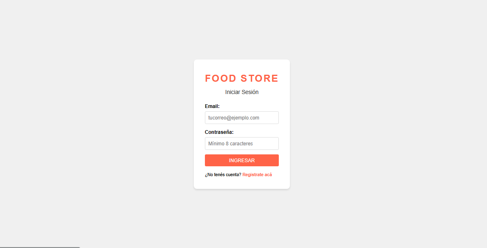
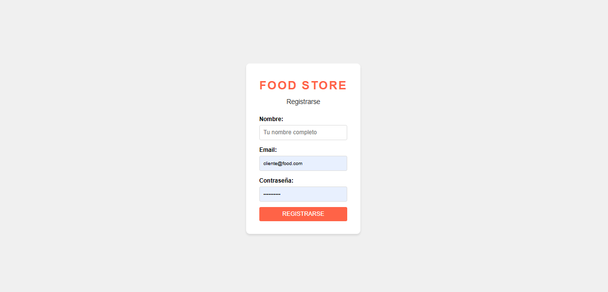
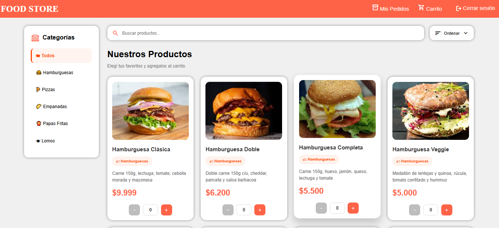
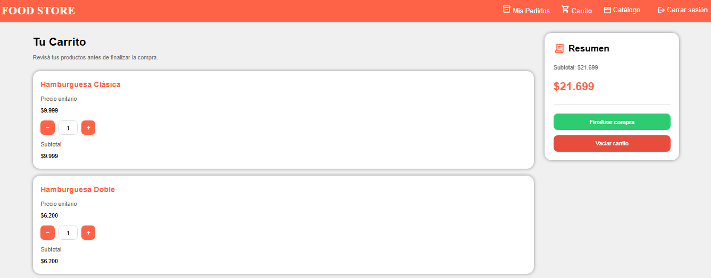
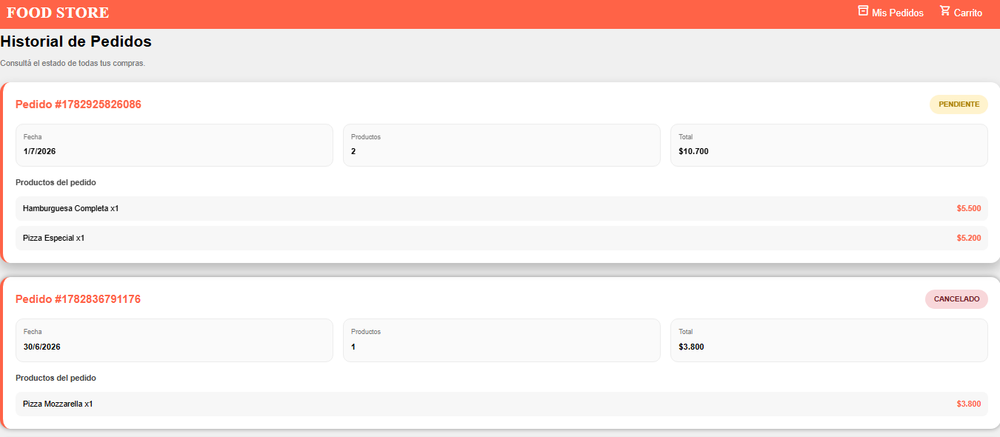
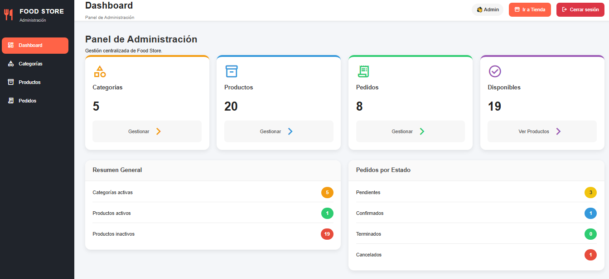
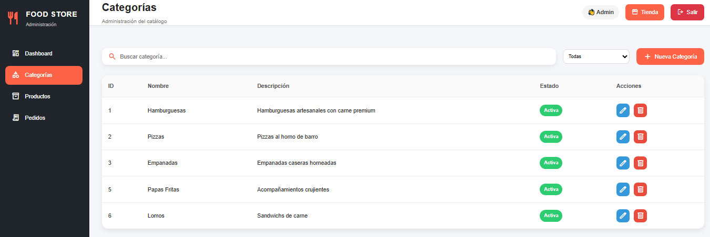
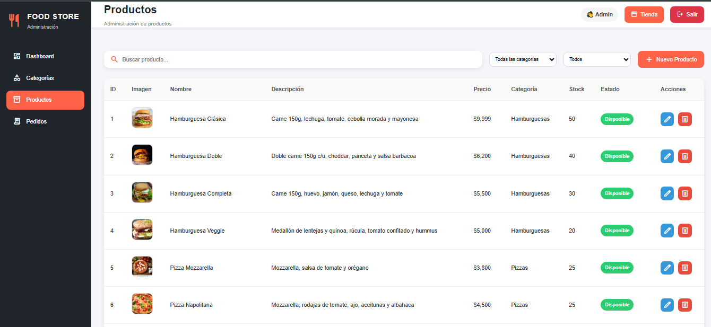
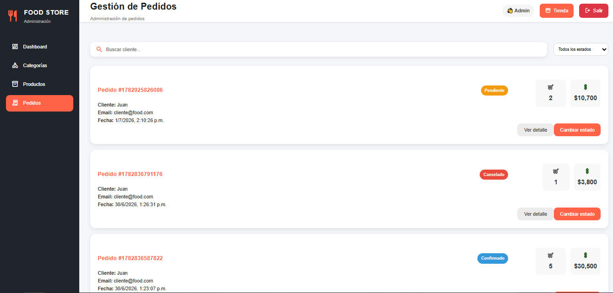

# 🍔 FoodStore


# Trabajo Práctico Integrador – Programación III

FoodStore es una aplicación **Full Stack** desarrollada como Trabajo Práctico Integrador para la materia **Programación III** de la **Tecnicatura Universitaria en Programación**.

El proyecto simula un sistema de gestión de pedidos para un negocio gastronómico, permitiendo a clientes navegar un catálogo de productos, realizar compras y consultar sus pedidos, mientras que los administradores pueden gestionar categorías, productos y pedidos desde un panel administrativo.

---

# 📚 Tabla de Contenidos

- Descripción
- Características
- Estado del Proyecto
- Tecnologías
- Arquitectura
- Modelo de Dominio
- Estructura del Proyecto
- Requisitos
- Instalación
- Configuración de Base de Datos
- Ejecución
- Roles del Sistema
- Persistencia
- Capturas
- Objetivos Académicos
- Autor

---

# 📖 Descripción

FoodStore fue desarrollado siguiendo una arquitectura separada en dos aplicaciones:

- **Frontend**, encargado de la interfaz de usuario y la experiencia de navegación.
- **Backend**, desarrollado con Java y JPA/Hibernate para gestionar la persistencia de datos mediante H2.

El proyecto implementa las funcionalidades solicitadas en la consigna del Trabajo Práctico Integrador, incluyendo autenticación, catálogo de productos, carrito de compras, historial de pedidos y panel de administración.

---

# 🚀 Características

## Cliente

- Inicio de sesión
- Catálogo de productos
- Búsqueda dinámica
- Filtro por categorías
- Ordenamiento de productos
- Vista de detalle
- Carrito de compras
- Historial de pedidos

## Administrador

- Dashboard
- Gestión de categorías
- Gestión de productos
- Gestión de pedidos
- Estadísticas generales

## Backend

- CRUD Categorías
- CRUD Productos
- CRUD Usuarios
- CRUD Pedidos
- Persistencia con JPA/Hibernate
- Consultas JPQL
- Baja lógica
- Validaciones de negocio

---

# ✅ Estado del Proyecto

## Backend

- ✅ Entidades JPA
- ✅ Relaciones JPA
- ✅ CRUD Categorías
- ✅ CRUD Productos
- ✅ CRUD Usuarios
- ✅ CRUD Pedidos
- ✅ Consultas JPQL
- ✅ Persistencia con H2
- ✅ Baja lógica
- ✅ Menú por consola

## Frontend

- ✅ Login
- ✅ Gestión de sesiones
- ✅ Roles
- ✅ Dashboard Administrativo
- ✅ Gestión de Categorías
- ✅ Gestión de Productos
- ✅ Gestión de Pedidos
- ✅ Catálogo
- ✅ Búsqueda
- ✅ Filtros
- ✅ Ordenamiento
- ✅ Detalle de Producto
- ✅ Carrito
- ✅ Historial de Pedidos

---

# 🛠 Tecnologías

## Frontend

- HTML5
- CSS3
- TypeScript
- Vite
- LocalStorage

## Backend

- Java 21+
- Gradle
- JPA
- Hibernate
- H2 Database

---

# 🏗 Arquitectura

El proyecto está dividido en dos aplicaciones independientes.

```
FoodStore
│
├── foodstore
│   ├── Frontend
│   └── Vite + TypeScript
│
└── foodstore-backend
    ├── Java
    ├── Gradle
    ├── Hibernate
    └── H2
```

El frontend utiliza archivos JSON y LocalStorage para la simulación de autenticación y persistencia.

El backend implementa persistencia utilizando JPA/Hibernate sobre una base de datos H2.

---

# 🗂 Modelo de Dominio

El backend implementa el siguiente modelo de entidades:

```
Base
│
├── Categoria
│      │
│      └── Producto
│
├── Usuario
│      │
│      └── Pedido
│               │
│               └── DetallePedido
```

### Entidades

- Base
- Categoria
- Producto
- Usuario
- Pedido
- DetallePedido

### Enumeraciones

- Rol
- Estado
- FormaPago

### Relaciones

- Categoría → Productos (1:N)
- Usuario → Pedidos (1:N)
- Pedido → Detalles (1:N)
- Detalle → Producto (N:1)

---

# 📁 Estructura del Proyecto

```
FoodStore/

├── foodstore
│
│   ├── src
│   ├── public
│   ├── data
│   ├── package.json
│   └── vite.config.ts
│
└── foodstore-backend
    ├── src
    ├── build.gradle
    ├── gradlew
    ├── gradlew.bat
    └── persistence.xml
```

---

# 📋 Requisitos

Antes de ejecutar el proyecto debe instalar:

- Java JDK 21 o superior
- Node.js 18 o superior
- npm
- Gradle (opcional si utiliza Gradle Wrapper)

Verificar instalación:

```bash
java -version
node -v
npm -v
gradle -v
```

---

# ⚙ Configuración de la Base de Datos

El backend utiliza una base de datos **H2 en modo archivo**.

La configuración se encuentra en:

```
src/main/resources/META-INF/persistence.xml
```

Características:

- No requiere instalación adicional.
- Hibernate crea automáticamente las tablas.
- La base se genera durante la primera ejecución.

---

# 💻 Instalación

## Clonar el repositorio

```bash
git clone https://github.com/USUARIO/foodstore.git
```

Ingresar al proyecto:

```bash
cd FoodStore
```

---

# 🔧 Backend

Ingresar a la carpeta:

```bash
cd foodstore-backend
```

Compilar:

Gradle

```bash
gradle build
```

Windows

```bash
gradlew.bat build
```

Linux / Mac

```bash
./gradlew build
```

---

## Ejecutar Backend

Gradle

```bash
gradle run
```

Windows

```bash
gradlew.bat run
```

Linux

```bash
./gradlew run
```

---

# 🌐 Frontend

Ingresar a la carpeta:

```bash
cd foodstore
```

Instalar dependencias

```bash
npm install
```

Ejecutar

```bash
npm run dev
```

Abrir en el navegador

```
http://localhost:5173
```

---

# 👥 Roles del Sistema

## Administrador

Puede:

- Gestionar categorías
- Gestionar productos
- Gestionar pedidos
- Visualizar estadísticas
- Administrar el sistema

---

## Usuario

Puede:

- Navegar el catálogo
- Buscar productos
- Filtrar productos
- Ordenar productos
- Agregar productos al carrito
- Consultar historial de pedidos
- Confirmar compras

---

# 💾 Persistencia

## Frontend

Persistencia mediante LocalStorage para:

- Usuario autenticado
- Carrito
- Pedidos
- Estado de sesión

## Backend

Persistencia mediante:

- JPA
- Hibernate
- Base de datos H2

---

# 📸 Capturas

## Login



---
## Registro



---

## Catálogo



---

## Carrito



---

## Mis Pedidos



---

## Dashboard



---

## Categorías



---

## Productos



---

## Pedidos (Administrador)



# 🎯 Objetivos Académicos

Durante el desarrollo del proyecto se aplicaron conocimientos de:

- Programación Orientada a Objetos
- Arquitectura por capas
- Persistencia con JPA
- Hibernate
- Gradle
- Consultas JPQL
- Manejo de relaciones entre entidades
- TypeScript
- Vite
- Manipulación del DOM
- LocalStorage
- Organización modular del código
- Desarrollo Full Stack

---

# 📈 Posibles Mejoras Futuras

- Integración entre frontend y backend mediante API REST.
- Implementación de Spring Boot.
- Autenticación con JWT.
- Base de datos MySQL o PostgreSQL.
- Panel responsive completo.
- Dockerización del proyecto.
- Testing automatizado.

---

# 👨‍💻 Autor

**Christian Olivero**

Tecnicatura Universitaria en Programación

Universidad Tecnológica Nacional (UTN)

---

## 📄 Licencia

Este proyecto fue desarrollado con fines exclusivamente académicos como Trabajo Práctico Integrador de la carrera **Tecnicatura Universitaria en Programación**.
# Autor

Christian Emmanuel Olivero

Tecnicatura Universitaria en Programación

Universidad Tecnológica Nacional
